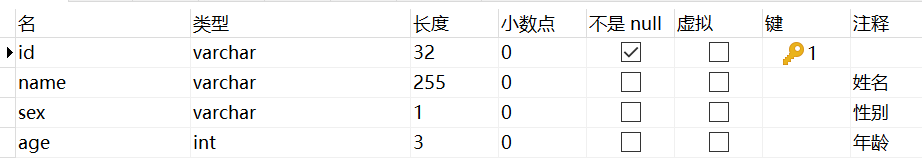

# PO、VO、DAO、BO、DTO

---

## 1. PO

PO（Persistant Object，持久对象）是伴随ORM而出现的产生的概念。

> ORM（Object Relation Mapping，对象关系映射）就是将数据库表与对象进行绑定，或者说将关系数据库表与对象进行相互映射，具体的映射操作由各种持久化框架完成。
>
> 关系数据库表：
>
> 
>
> 类：
>
> ```java
> @Entity
> @Table(name = "user")
> public class UserPO{
>     @Id
>     private String id;
>     
>     @Column
>     private String name;
>     
>     @Column
>     private String sex;
>     
>     @Column
>     private Integer age;
>     
>     //此处略去getXXX()、setXXX()方法
> }
> ```

PO对应着数据库中的一张表，一个PO实例对应着表中的一条记录。PO中不应该包含任何数据库操作，PO应该专注于与数据库表进行映射。

## 2. VO

VO（Value Object、View Object，值对象、视图对象）通常用于业务层之间的数据传递，仅包含数据。

## 3. DAO

DAO（Data Access Object，数据访问对象），用于访问数据库，通常与PO结合使用，DAO中包含了各种数据库的操作方法，DAO处于业务层逻辑与数据库资源中间。

## 4. BO

BO（Business Object，业务对象）是封装了业务逻辑的对象，通过调用DAO中的方法，并结合PO、VO完成业务操作。

## 5. DTO

DTO（Data Transfer Object，数据传输对象）主要用于数据传输，不应该包含业务逻辑。

