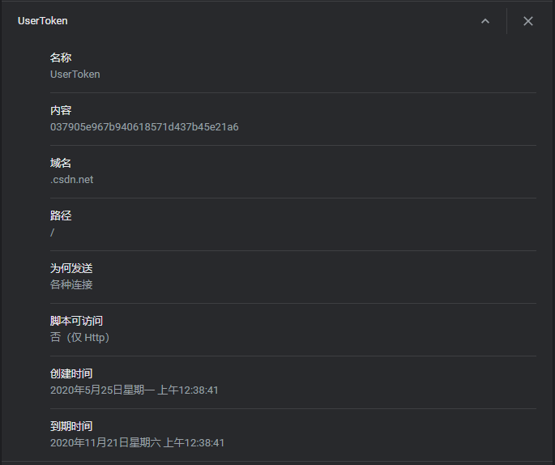

# Cookie

## 简介

Cookie 是一种由服务端生成、在客户端保存（内存或硬盘）的用于标识用户身份和进行会话跟踪的特殊数据（通常需要经过加密处理），是Web应用实现用户认证的重要手段。

HTTP 协议是一种无状态协议，服务端将接收到的每个 HTTP 请求都视为相互独立、互不相干的访问请求。然而，维持状态对许多 Web 应用来说十分重要。购物网站的购物车就是一个很好的例子，它需要准确的将商品添加到某个用户的购物车。

访问 CSDN 后网站保存到本地的一个Cookie

## 实现过程

基于 Cookie 的认证过程，主要由以下三个阶段组成：

1. 发布

    当用户试图访问某个 Web 站点中需要认证的资源时，服务端会检查用户是否提供了认证 Cookie，如果没有，则将用户重定向到登陆页面。在用户成功登陆后，服务端将产生认证 Cookie，并通过 HTTP 响应发送给客户端，接着将用户重定向到初始请求的资源。

2. 检索

    在用户随后的访问请求中，客户端浏览器检索 Path 和 Domain 等属性与用户当前请求的资源相匹配的 Cookie，然后将 Cookie 通过 HTTP 请求提交给服务端。

3. 验证

    服务端接收到客户端的请求后，提取出 Cookie，验证其中的用户信息，若合法，则将请求的资源发送给客户端，反之则拒绝客户端的请求。

## 局限性

1. 大小限制、数量限制
2. 禁用问题
3. 安全问题
4. 兼容问题
