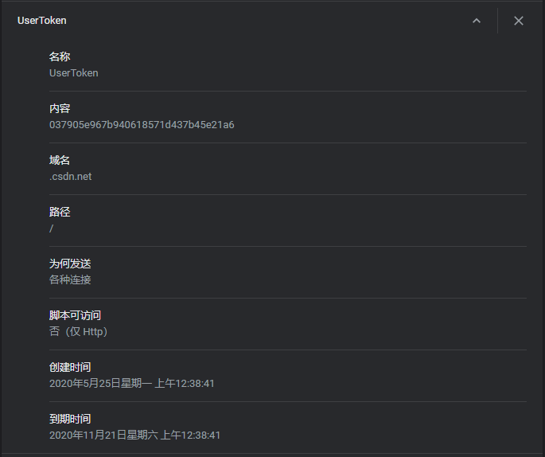
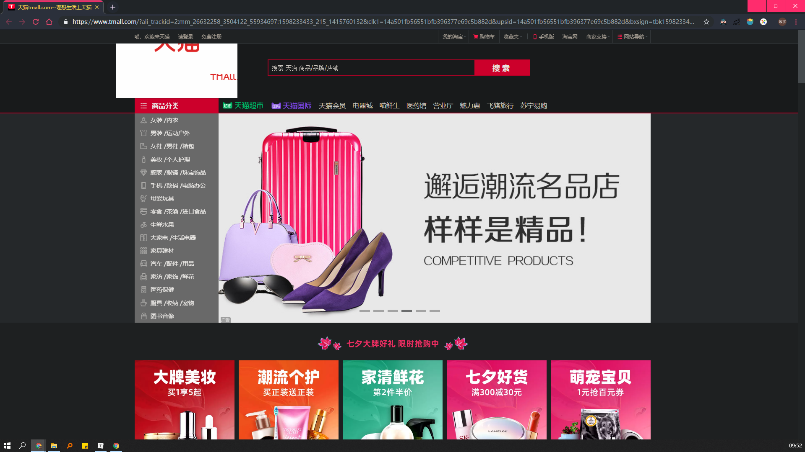
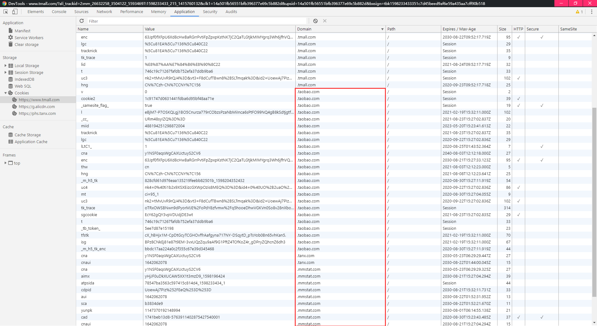
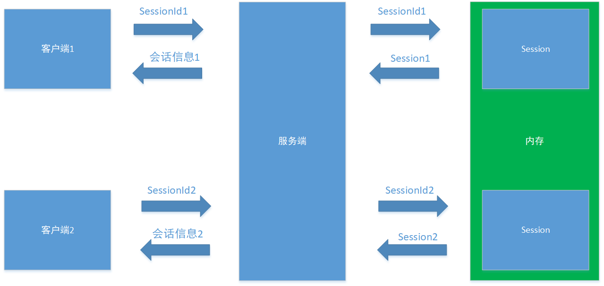

# 会话跟踪

## 1. 简介

**HTTP** 是一种`无状态协议`，服务端不保留与客户端沟通时的任何状态，这种设计减轻了服务器的记忆负担，使服务器能够向更多的客户端提供更快的服务。**会话**是客户端与服务器之间一次完整的交流过程，在此期间，客户端可能向服务器发送多次 HTTP 请求。

如果 HTTP 协议只是用来访问静态网页，那不会有任何问题，但是如果要为广大用户提供更好的服务，服务器就必须知道每个请求具体来自哪个用户，比如我们逛淘宝的时候，仅需要进行一次登陆，后续所有操作：添加购物车、支付，服务端都不在提醒我们进行身份核验。

**会话跟踪**是一种在客户端和服务器之间保持 HTTP 状态的解决方案。从技术角度考虑，会话跟踪实现了在同一个会话的多次 HTTP 请求间共享数据。目前常见的**会话跟踪技术**有：Cookie、Session、URL重写、隐藏表单域。

## 2. 会话跟踪技术

### 2.1 Cookie

#### 2.1.1 简介

Cookie 是一种由服务端生成、在客户端保存（内存或硬盘）的用于标识用户身份和进行会话跟踪的特殊数据（通常需要经过加密处理），是 Web 应用实现用户认证（即判断多个请求是否来自同一个客户端）的重要手段。




<center>图2.1 访问 CSDN 后客户端获取到的一个 Cookie</center>

#### 2.1.2 实现过程

基于 Cookie 的认证过程，主要由以下三个阶段组成：

1. 发布

    当用户试图访问某个 Web 站点中需要认证的资源时，服务端会检查用户是否提供了认证 Cookie，如果没有，则将用户重定向到登陆页面。在用户成功登陆后，服务端将产生认证 Cookie，并通过 HTTP 响应发送给客户端，接着将用户重定向到初始请求的资源。

2. 检索

    在用户随后的访问请求中，客户端浏览器检索 Path 和 Domain 等属性与用户当前请求的资源相匹配的 Cookie，然后将 Cookie 通过 HTTP 请求提交给服务端。

3. 验证

    服务端接收到客户端的请求后，提取出 Cookie，验证其中的用户信息，若合法，则将请求的资源发送给客户端，反之则拒绝客户端的请求。

#### 2.1.3 属性

通常，Cookie 是一段大小不超过4K的文本数据，由一个名称、一个值以及若干用于控制 Cookie 有效期、安全性、使用范围的可选属性组成：

| 属性     | 描述                                                         |
| -------- | ------------------------------------------------------------ |
| name     | 必需。设置 cookie 的名称。                                   |
| value    | 必需。设置 cookie 的值。                                     |
| expires  | 可选。设置 cookie 的生存期。根据生存期的特点，cookie 可以分为 `会话型 cookie` 和 `持久型  cookie`。会话型 cookie 存储在客户端内存中，在用户关闭浏览器时失效；持久型 cookie 存储在客户端硬盘中，直至生存期结束或用户手动销毁时失效。默认情况下，cookie 为会话型 cookie。 |
| path     | 可选。设置了 web 站点可以访问该 cookie 的目录。              |
| domain   | 可选。指定了可以访问该 cookie 的 web 站点或域。**cookie 机制并未严格遵循同源策略，允许子域获取或设置其父域的 cookie。**当需要实现**单点登陆**方案时，cookie 的上述特性非常有用，但是，这也增加了 cookie 被攻击的可能性，因此，为了减小攻击发生的范围，浏览器禁止在 domain 属性中设置 .org  .com 等通用顶级域名、国家及地区顶级域名下注册的二级域名。 |
| secure   | 可选。设置 cookie 是否使用 https 安全协议发送。              |
| httponly | 可选。设置客户端脚本能够通过 document.cookie 属性访问 cookie，有助于保护 cookie 不被跨站脚本攻击窃取或篡改。httponly 的应用存在一定的局限性，一些浏览器可以阻止客户端脚本对 cookie 的读操作，但允许写操作；此外大多数浏览器仍允许通过对象读取响应中的 Set-Cookie头。 |

#### 2.1.4 缺点

1. 大小、数量限制
2. 安全问题
3. 禁用问题

#### 2.1.5 第三方 cookie

当我们正常浏览天猫，天猫会把我们的信息写入一些 cookie ，并将 cookie 的domain 属性设置为 .tmall.com 这个域。然而，如果我们打开控制台就会发现，并非所有 cookie 的 domain 属性都是 .tmall.com 这个域，有很多 cookie 的 domain 属性被设置成了其他域，这些 domain 属性 没有被设置为当前域的 cookie 就是第三方 cookie。



<center>图2.2 打开天猫首页</center>



<center>图2.3 浏览天猫时产生的第三方 cookie</center>

虽然目前我们还没有访问过这些域，但是它们已经通过这些第三方 cookie 来标识和获取我们的信息。当我们打开 taobao.com，我们发现淘宝已经获取了我们在天猫的登陆信息。 因为淘宝、天猫都是阿里旗下的产品，阿里为它们提供了统一的登陆服务。

#### 2.1.5 主要作用

Cookie 主要用于以下三个方面：

1. 会话状态管理

    如用户登陆状态、购物车、游戏分数或其他需要记录的信息

2. 个性化设置

    如用户自定义设置、主题等

3. 浏览器行为跟踪

    如跟踪分析用用户的行为等

### 2.2 URL重写

#### 2.2.1 简介

通过 url 实现会话跟踪的原理其实就是将会话的标识信息添加到 url，对于客户端的每一个 http 请求，服务端都能从 url 中提取会话标识信息，从而实现会话的跟踪。

#### 2.2.3 优点

1. 不像 cookie 那样存在被禁用的问题。

#### 2.2.2 缺点

1. URL 长度限制

    首先，http 协议并未限制 url 的长度，在官方文档中有下面一段话：

    **The HTTP protocol does not place any a priori limit on the length of a URI. **Servers MUST be able to handle the URI of any resource they serve, and SHOULD be able to handle URIs of unbounded length if they provide GET-based forms that could generate such URIs. A server SHOULD return 414 (Request-URI Too Long) status if a URI is longer than the server can handle (see section 10.4.15).

      *Note: Servers ought to be cautious about depending on URI lengths above 255 bytes, because some older client or proxyimplementations might not properly support these lengths.*

    > 译：
    >
    > HTTP 协议对 URI 的长度没有任何先验限制。服务器必须能够处理其服务的任何资源的 URI，并且如果服务器提供可以生成此类 URI 的基于GET的形式，则必须能够处理无限长度的 URI。如果URI的长度超过了服务器的处理能力，则服务器应返回414（请求URI太长）。
    >
    > 注意：服务器应该谨慎使用超过255字节的 URI 长度，因为有一些旧的客户端或者代理实现可能无法正确支持这些长度。

    虽然 http 协议中并未明确对 url 的长度进行限制，但在实际使用中 url 的长度还是受到来自两个方面的限制：服务端和浏览器。以nginx服务器为例，其默认的 url 长度限制为4k。下面是一些常用的浏览器对 url 长度的限制：

    | 浏览器  | 最大长度（字符数） |
    | ------- | ------------------ |
    | IE      | 2083               |
    | Chrome  | 8182               |
    | Firefox | 65,536             |
    | Safari  | 80,000             |
    | Opera   | 190,000            |

    因为 url 的长度存在限制，通过 url 保存的会话标识信息的长度自然也要受到限制。

2. 保密性较低

    一般在关闭浏览器后，保存在服务器里的会话标识信息并不会马上失效，在一段时间内，用户请求过的重写 url 仍然有效，他人只需要从浏览器的历史记录中找到该 url，就可以点击进入用户访问过的网页，且不需要任何密码验证。

### 2.3 隐藏表单域

#### 2.3.1 简介

隐藏表单域利用了 HTML 中的 hidden 属性，通过下列方式，将会话标识信息偷偷发送给服务端：

```html
<input type = "hidden" name = "userId" value = "as89dfasd0fa8sd0f8as0dff80asdsd">
```

#### 2.3.2 优点

1. 不存在 cookie 那样的被禁用问题；
2. 不存在 url 长度限制。

#### 2.3.3 缺点

1. 安全性较低

    只要查看 html 源码，保存的会话标识信息就会暴露无遗。

### 2.4 Session

#### 2.4.1 简介

Session 是由服务端创建和保存的一个对象，用于保存特定的客户端与服务端交流时需要使用的信息。当客户端第一次向服务端发送请求，服务端会创建一个 Session 对象保存客户端信息，然后将 Session 对象的 Id 返回给客户端；再次向客户端发送请求时，客户端会将获取到的 session id 一起发送给服务端，服务端接收到 session id后，查找相应的 Session 对象，如果存在，则说明用户



#### 2.4.2 优点

#### 2.4.3 缺点

1. 服务器负担

#### 2.4.4 Session 与 Cookie 的对比

Session 与 Cookie 的区别：

1. 存储位置不同

    Cookie  由客户端负责存储，Session 由服务端负责存储。

2. 能够存储的数据类型不同

    Cookie 只能存储字符类型的数据，Session 可以存储任意类型的数据。

3. 能够存储的数据大小不同

    Cookie 受限于浏览器，能够存储的数据一般不会超过4k；Session 受限于服务器，能够存储的数据远超 Cookie。

4. 有效期不同

    Cookie 可以设置较长的有效时间，Session 的有效时间较短，一般在客户端关闭浏览器时就会失效。

5. 安全性不同

    由于 Cookie 保存在客户端，Session 保存在服务端，所以 Cookie 的安全性低于 Session。

Session 与 Cookie 的联系：

